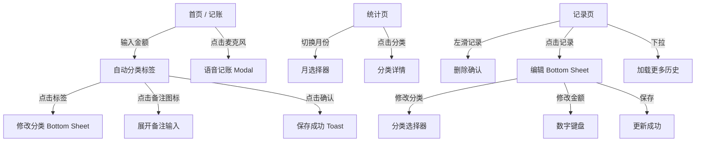

# 个人记账工具 (Daily Expense Tracker) — 设计规格说明

> 版本: V0.1 (MVP)
> 平台: 微信小程序
> 设计阶段: 策略层方向定义

---

## 1. 项目概况

### 1.1 产品定位

极简个人记账工具，面向「想记账但坚持不下来」的年轻上班族。核心价值主张：**打开即记，智能分类，零广告**。

### 1.2 目标用户画像

| 属性 | 描述 |
|------|------|
| 人口特征 | 张先生/女士，25-32岁，一二线城市上班族，月薪10-20K，租房或无孩家庭 |
| 痛点 | 用过3+款记账App都放弃——"记一笔比花一笔还累"；厌恶广告和诱导付费 |
| 行为习惯 | 微信高频用户，日均打开小程序1-3次，每次使用<30秒 |
| 动机 | 控制月度支出，而非精确对账；需要"模糊感知"而非"精确分类" |
| 放弃记账原因 | 操作路径长（1-3）、分类选择焦虑（4）、遗忘补记（5）、广告干扰（6） |

### 1.3 设计范围

| 阶段 | 范围 | 页面数 |
|------|------|--------|
| P0-MVP | 快速记账 + 本月概要 + 按周趋势 | 3 主页面 |
| P1-V1 | 语音记账 + 记录列表 + 编辑/删除 + 智能分类 | 新增 2 页面/面板 |

---

## 2. 设计目标

| # | 目标 | 衡量标准 | 优先级 |
|---|------|----------|--------|
| G1 | **10秒完成一笔记账** | 从打开小程序到保存成功，< 10秒 | P0 |
| G2 | **零学习成本** | 首次用户无需引导即可完成第一笔记账 | P0 |
| G3 | **账面感知清晰** | 用户打开即可回答"这个月花了多少、花在哪" | P0 |
| G4 | **分类不纠结** | 智能推荐正确率 > 70%，用户手动调整率 < 30% | P1 |

---

## 3. 设计原则

### P1. 默认即正确
- 系统自动推断分类，不主动展示分类选择器
- 推断错误时，允许一键修正，但不强迫用户预先选择
- 输入即保存原则，不要求确认流程（除非金额可疑）

### P2. 拇指优先
- 所有交互操作发生在屏幕下半区（拇指自然覆盖区）
- 输入区（数字键盘）固定在底部，不随滚动而移动
- 超过 1/3 屏高的弹窗，可手势下拉关闭

### P3. 克制即高效
- 每个页面只有一个核心操作（首页 = 输入金额，统计页 = 阅读）
- 无冗余装饰、无动效炫技、无营销文案
- 隐藏非必要 UI 元素，需要时 1 步展开

### P4. 离线优先
- 所有数据本地存储，不依赖网络
- 冷启动即开即用，无加载/同步等待
- 即便是无网络环境，功能完全可用

### P5. 安静的工具
- 无推送通知、无积分/签到、无社交分享
- 无任何形式的广告和商业推广
- 反馈仅使用轻微的触感/视觉反馈，不打断用户

---

## 4. 信息架构

### 4.1 导航结构

```
[Tab Bar: 底部 3 项]
├── 首页 (记账) ── 核心入口，默认页
├── 统计 ── 本月支出总览
└── 记录 ── 时间线列表

[Modal / Sheet / 页面（从首页触发）]
├── 修改分类 Bottom Sheet
├── 添加备注 (Inline 展开)
├── 语音记账 (半屏 Modal)
├── 编辑记录 (Bottom Sheet)
└── 日历选择器
```

### 4.2 页面关系图



### 4.3 核心用户流

**流 A: 快速记账（最常用，> 80% 的使用场景）**
```
打开小程序 → 首页聚焦金额输入 → 输入金额 → 系统自动推荐分类
  → (可选) 点击分类标签修改 → 点击确认 → 保存 → 自动清空准备记下一笔
```

**流 B: 语音记账**
```
打开小程序 → 点击麦克风 → 语音说"早餐花了12块" → 系统解析
  → 预填金额 + 分类 → 用户确认/修改 → 保存
```

**流 C: 查看支出 + 修正记录**
```
打开小程序 → 切换到统计页 → 看饼图/趋势
  → 发现某分类异常 → 切换到记录页 → 找到该记录 → 左滑删除或点击编辑
```

---

## 5. 页面结构

### 5.1 首页 — 快速记账

**页面定位**: 打开小程序的默认页，也是整个产品的核心交互入口。用户 90% 的时间停留在此。

**布局（从上到下）**:

```
┌─────────────────────────────────┐
│ [Status Bar]                     │ 微信原生，不自定义
├─────────────────────────────────┤
│ [今天  ¥128.50]                  │ 当日汇总（引用头，非沉浸）
│ 昨日  ¥86.00                     │
├─────────────────────────────────┤
│                                 │
│         ￥ 0.00                  │ 金额显示区，大号字体 (40-48px)
│          餐饮  >                 │ 自动分类标签（可点击修改）
│          [ 写备注... ]           │ 备注输入（默认折叠，点击展开）
│                                 │
├─────────────────────────────────┤
│ [  7  ][  8  ][  9  ][  ⌫ ]    │
│ [  4  ][  5  ][  6  ][  +  ]    │
│ [  1  ][  2  ][  3  ]           │ 数字键盘（4x4，底部固定）
│ [  00  ][  0  ][  .  ][ ✓ ]     │ 确认键用主题色突出
└─────────────────────────────────┘
```

**关键行为**:

| 触发 | 响应 |
|------|------|
| 打开小程序 | 聚焦金额输入，键盘自动弹出 |
| 输入数字 | 金额实时更新，自动推断分类（延迟 300ms 后匹配） |
| 点击分类标签 | 弹出修改分类 Bottom Sheet |
| 点击确认 (✓) | 保存记录，短暂 Toast 反馈，清空输入 |
| 长按退格 (⌫) | 快速清除全部金额 |
| 点击麦克风 | 进入语音记账（P1 实现） |

**状态覆盖**:

| 状态 | 表现 |
|------|------|
| 默认（未输入） | 金额显示 `￥ 0.00`，分类标签隐藏，备注折叠 |
| 输入中 | 金额更新，分类标签出现（带加载骨架 200ms） |
| 已分类 | 标签显示分类名 + 图标，带淡入动画 |
| 保存成功 | 金额区域闪绿色 500ms，清空归零 |
| 未推断分类 | 标签显示「选择分类 >」灰色提示 |
| 金额过大(>99999) | 输入上限限制，Toast 提示上限 |

---

### 5.2 统计页

**页面定位**: 月度支出总览，让用户在 3 秒内感知"花在哪、花了多少、趋势如何"。

**布局（从上到下，可滚动）**:

```
┌─────────────────────────────────┐
│ [ < 2026年7月  > ]              │ 月份切换器（左右箭头）
├─────────────────────────────────┤
│ 本月支出  ¥3,280.50             │ 总支出（大号数字 32px）
│ 日均 ¥108.52                    │ 辅助数据
├─────────────────────────────────┤
│      [ 饼图 / 环形图 ]          │ 分类占比（可旋转交互）
│      餐饮  35%                   │
│      交通  18%                   │
│      居住  25%      .....        │
├─────────────────────────────────┤
│ 分类排行 Top5                    │
│ ────────────────                │
│ 餐饮     ■■■■■■■■■■  ¥1,148     │ 横向条形图
│ 居住     ■■■■■■■    ¥820       │
│ 交通     ■■■■■      ¥590       │
│ 购物     ■■■■       ¥420       │
│ 娱乐     ■■■        ¥302       │
├─────────────────────────────────┤
│ 消费趋势                          │
│ [  周  ]  [  月  ]                 │ Segmented Control
│ ┌─────────────────────────┐     │
│ │     ╱╲    ╱╲            │     │ 折线图（SVG/Canvas）
│ │    ╱  ╲  ╱  ╲  ╱╲      │     │
│ │   ╱    ╲╱    ╲╱  ╲     │     │
│ │  ╱                  ╲    │     │
│ │ ╱                    ╲   │     │
│ └─────────────────────────┘     │
│ 周一 周二 周三 周四 周五 周六 周日│
└─────────────────────────────────┘
```

**关键行为**:

| 触发 | 响应 |
|------|------|
| 点击月份箭头 | 左右切换，数据平滑过渡 |
| 点击饼图扇区 | 扇区外扩 5px，显示该分类明细 |
| 点击分类排行项 | 跳转到记录页并过滤该分类 |
| 切换周/月趋势 | 折线图数据源切换，过渡动画 300ms |

**空状态**: 当月无记录时，显示「还没有支出记录，去记一笔吧」+ 快速跳转首页按钮。

---

### 5.3 记录页

**页面定位**: 完整的支出时间线，用于回顾、编辑和删除历史记录。

**布局（从上到下，可滚动）**:

```
┌─────────────────────────────────┐
│ [  全部  ] [  餐饮  ] [  交通...│ 分类筛选 Tags (可横向滚动)
├─────────────────────────────────┤
│                                 │
│  今天                            │ 日期分组标题
│ ┌───────────────────────────┐   │
│ │ 🍜 餐饮     ¥32      >  │   │ 记录卡片
│ │    午餐 12:30              │   │
│ │                            │   │
│ │ 🚌 交通     ¥4       >  │   │
│ │    公交 08:15              │   │
│ └───────────────────────────┘   │
│                                 │
│  昨天                            │
│ ┌───────────────────────────┐   │
│ │ 🛒 购物     ¥289     >   │   │
│ │    超市日用品 19:20        │   │
│ │                            │   │
│ │ 🍜 餐饮     ¥56      >   │   │
│ │    和朋友吃饭 18:30        │   │
│ └───────────────────────────┘   │
│                                 │
│  12月28日                        │
│  ...                            │
│  ...                            │
├─────────────────────────────────┤
│ [ 加载更多 ]                     │ 到底自动加载，也可手动点击
└─────────────────────────────────┘
```

**关键行为**:

| 触发 | 响应 |
|------|------|
| 点击分类筛选 Tag | 列表过滤，Tag 高亮选中态 |
| 左滑记录 | 显示红色「删除」按钮，松手删除 + 撤销 Toast |
| 点击记录 | 弹出编辑 Bottom Sheet |
| 下拉列表 | 加载更早月份数据 |
| 空状态 | 显示「还没有记录」插画 + 引导记一笔 |

**记录卡片结构**:

```
┌───────────────────────────────┐
│ 🍜 餐饮               ¥32    │ 图标 + 分类名 (左) | 金额 (右)
│    午餐 12:30                 │ 备注 + 时间 (次要信息，小字灰色)
│                               │
│ [编辑]    [删除]              │ 隐藏操作，左滑露出
└───────────────────────────────┘
```

---

### 5.4 编辑 Bottom Sheet

**页面定位**: 修改已保存记录的金额、分类、备注。从记录列表点击触发。

**布局**:

```
┌─────────────────────────────────┐
│  ─── (拖拽手柄)                  │
│                                 │
│  编辑支出                        │ 标题
│                                 │
│  [ 分类: 餐饮 > ]               │ 分类选择
│  [ 金额: ¥32.00       ]        │ 金额输入（点击展开数字键盘）
│  [ 备注: 午餐           ]       │ 备注输入
│  [ 时间: 2026-07-01 12:30 ]    │ 日期时间
│                                 │
│  [  删除  ]    [  保存  ]       │ 双按钮
└─────────────────────────────────┘
```

**交互要求**:
- 底部 Sheet 半屏展开，不遮盖完全屏幕
- 点击金额唤起数字键盘（替换 Sheet 下半区）
- 保存失败时，Sheet 不下滑，原地显示错误提示
- 上滑手势可关闭 Sheet

---

### 5.5 语音记账 Modal

**页面定位**: 快速语音输入，降低记录门槛。从首页麦克风按钮触发。

**布局**:

```
┌─────────────────────────────────┐
│  ───                            │
│                                 │
│      🎤                         │ 大号麦克风图标 (动态脉冲效果)
│     "说点什么..."                │ 提示文字
│                                 │
│  [  开始录音  ]                  │ 按钮，录音中变为红色
│                                 │
├─────────────────────────────────┤
│  识别结果预览                     │
│  ¥12.00   餐饮                   │
│  [  确认  ]  [  重录  ]         │
└─────────────────────────────────┘
```

**交互要求**:
- 点击开始 → 调用微信录音接口
- 录音中麦克风图标脉冲动画
- 松开/点击停止 → 语音识别 → 3s内显示解析结果
- 解析失败时显示「没听清，请再说一遍」
- 确认后自动回到首页并填充数据

---

## 6. 交互规范

### 6.1 全局手势

| 手势 | 区域 | 行为 |
|------|------|------|
| 左滑 | 记录页卡片 | 露出删除按钮 |
| 下拉 | 记录页 | 加载更多历史 |
| 上滑 | 记录页 | 回到顶部 |
| 点击空白 | 任何页面 | 取消焦点 / 关闭键盘 |
| 边缘滑动 | 首页 | 切换 Tab (可选，可用系统手势) |

### 6.2 输入逻辑

**金额输入**:
- 默认聚焦，键盘升起
- 不支持负号，不支持超过两位小数
- 最大输入值 ¥99,999.99，超过上限 Toast 提示
- 输入首位为 `0` 时自动补 `0.`（即输入 0 → 显示 0.）
- 输入 `00` 时忽略，保持当前值

**自动分类推断**:
- 检测时机: 输入完成（停止输入 800ms）或确认键触发
- 匹配规则应按优先级排列：
  1. 时段 + 金额范围匹配（最高优先级）
  2. 仅金额范围匹配
  3. 仅时段匹配
  4. 该时间段的用户历史最常分类
  5. 均无法匹配 → 显示「选择分类」
- 匹配后展示分类名 + emoji 图标
- 用户手动修改后的分类，记录上下文用于模型学习

**自动分类规则规则**:

| 条件 | 推断分类 |
|------|----------|
| 6:00-9:30 + ¥5-¥30 | 餐饮(早餐) |
| 11:00-13:30 + ¥15-¥50 | 餐饮(午餐) |
| 17:00-20:00 + ¥15-¥80 | 餐饮(晚餐) |
| 7:00-9:30 或 17:00-19:30 + ¥1-¥10 | 交通 |
| 22:00-5:00 + ¥0-¥100 | 夜宵 |
| ¥1-¥5 | 其他小额 |
| 其他 | 用户历史最常分类 |

### 6.3 保存策略

- **即时保存**: 点击确认键立即保存至本地存储（wx.setStorageSync）
- **保存反馈**: 绿色闪烁 300ms + 轻微触感（如设备支持）
- **保存失败**: 红色 Toast + 数据暂存于内存，不丢失
- **退出时未保存**: 自动丢弃（简化复杂度，不保留草稿）

### 6.4 反馈机制

| 交互 | 反馈方式 | 持续时间 |
|------|----------|----------|
| 确认保存 | 金额区域绿色闪烁 | 300ms |
| 删除记录 | 红色 Toast + 撤销按钮 | 3s 内可撤销 |
| 分类修改 | 标签原位更新 + 轻微缩放动画 | 200ms |
| 语音识别完成 | 柔和提示音 + 结果显示 | - |
| 操作错误 | 红色文字提示，无弹窗 | 1.5s 自动消失 |
| 空状态 | 插画 + 文案（非纯文字） | 持续显示 |

### 6.5 键盘交互

- 数字键盘为自定义组件（非系统键盘），保证在所有机型上表现一致
- 点击数字时伴随轻微触感反馈（长按无重复输入）
- 退格键支持长按连续删除（延迟 300ms 后加速）
- 确认键在金额为 0 时置灰不可点击
- 键盘区高度固定：226px（适配主流机型）

---

## 7. 视觉方向

### 7.1 风格关键词

```
极简 · 清晰 · 安静 · 温暖 · 工具感
```

- 白色/浅灰底色为主，信息层级用留白和字号区分，而非边框和色块
- 以「字为图、空为框」的排版哲学 — 文字本身就是视觉元素
- 不滥用阴影，深度感通过轻微层次（1-2层）实现

### 7.2 字体规范

| 层次 | 字号 | 字重 | 行高 | 用途 |
|------|------|------|------|------|
| 金额数字 | 40px | Medium | 1.2 | 输入中/展示中金额 |
| 大标题 | 20px | Semibold | 1.3 | 页面标题、Tab 选中态 |
| 正文强调 | 17px | Medium | 1.4 | 记录金额、分类名 |
| 正文 | 15px | Regular | 1.5 | 备注、标签文字 |
| 辅助信息 | 13px | Regular | 1.4 | 日期、提示文字 |
| 微小 | 11px | Regular | 1.3 | 分类占比百分比 |

- 字体栈: `-apple-system, BlinkMacSystemFont, "PingFang SC", "Helvetica Neue", sans-serif`
- 数字使用 tabular-nums（等宽数字），便于金额纵向对齐

### 7.3 调色板

**基础色**:

| Token | 色值 | 用途 |
|-------|------|------|
| --color-bg | #FFFFFF | 页面背景 |
| --color-surface | #F8F9FA | 卡片、区块背景 |
| --color-border | #E8EAED | 极细分割线（1px） |
| --color-text-primary | #1A1A2E | 主文字 |
| --color-text-secondary | #6B7280 | 次要文字 |
| --color-text-tertiary | #7B8794 | 辅助/占位文字（WCAG AA ≥4.5:1） |

**主题色**:

| Token | 色值 | 用途 |
|-------|------|------|
| --color-accent | #00A86B | 确认键、选中态、正向强调 |
| --color-accent-soft | #E8F5E9 | 浅绿背景（分类标签浅底） |
| --color-accent-text | #007A4D | 深绿色（分类标签文字） |

**语义色**:

| Token | 色值 | 用途 |
|-------|------|------|
| --color-danger | #DC2626 | 删除、错误提示（WCAG AA ≥4.5:1） |
| --color-warning | #F59E0B | 警告、待处理 |
| --color-income | #10B981 | 收入（可选功能，V1+） |

**分类色**（10色，用于饼图和分类图标）:

| 分类 | 色值 |
|------|------|
| 餐饮 | #FF6B6B |
| 交通 | #4ECDC4 |
| 购物 | #A8E6CF |
| 居住 | #FFD93D |
| 娱乐 | #6C5CE7 |
| 医疗 | #FF8A5C |
| 教育 | #45B7D1 |
| 通讯 | #96CEB4 |
| 人情 | #DDA0DD |
| 其他 | #B0B0B0 |

### 7.4 间距系统

采用 `4px` 为基数的间距网格:

```
--space-1: 4px
--space-2: 8px
--space-3: 12px
--space-4: 16px
--space-5: 20px
--space-6: 24px
--space-8: 32px
--space-12: 48px
```

### 7.5 圆角规范

| Token | 值 | 用途 |
|-------|-----|------|
| --radius-sm | 6px | 分类标签、小控件 |
| --radius-md | 10px | 卡片、输入框 |
| --radius-lg | 16px | Bottom Sheet、Modal |
| --radius-full | 999px | 按钮、FAB |

### 7.6 阴影规范

| Token | 值 | 用途 |
|-------|-----|------|
| --shadow-sm | 0 1px 2px rgba(0,0,0,0.05) | 浅层卡片 |
| --shadow-md | 0 2px 8px rgba(0,0,0,0.08) | Bottom Sheet |
| --shadow-lg | 0 4px 16px rgba(0,0,0,0.12) | Modal |

### 7.7 图标风格

- **统一使用 Material Design Icons (MDI)** 作为全项目图标库
  - Webfont 方式引入：`@mdi/font` 或 CDN `<link>` 引入 `materialdesignicons.css`
  - 使用 `mdi mdi-*` class 调用图标
- **分类图标**（MDI 映射）：
  | 分类 | MDI 图标 |
  |------|----------|
  | 餐饮 | `mdi-food` |
  | 交通 | `mdi-bus` |
  | 购物 | `mdi-shopping` |
  | 居住 | `mdi-home` |
  | 娱乐 | `mdi-gamepad-variant` |
  | 医疗 | `mdi-hospital-box` |
  | 教育 | `mdi-school` |
  | 通讯 | `mdi-cellphone` |
  | 人情 | `mdi-hand-heart` |
  | 其他 | `mdi-dots-horizontal-circle` |
- **功能图标**（Tab 栏等）：统一使用 MDI 线条风格，默认 24px
  - 记账 Tab：`mdi-pencil`
  - 统计 Tab：`mdi-chart-pie`
  - 记录 Tab：`mdi-format-list-bulleted`
- 图标颜色通过 `color` CSS 属性控制，与文字颜色令牌联动
- **不再使用 Emoji 或 SF Symbols**，确保跨平台视觉一致

---

## 8. 组件清单

### 8.1 组件层级映射

```
一级组件（跨页面复用）
├── TabBar — 底部导航栏
├── NumPad — 数字键盘
├── AmountDisplay — 金额展示
├── CategoryTag — 分类标签（含自动推断态）
├── Toast — 轻提示
├── BottomSheet — 底部弹出面板
└── Loading — 加载状态

二级组件（页面内使用）
├── PieChart — 饼图 / 环形图
├── LineChart — 折线图
├── CategoryRanking — 分类排行列表
├── RecordCard — 记录卡片
├── DateGroupHeader — 日期分组标题
├── FilterTag — 分类筛选项
├── EmptyState — 空状态占位
├── MonthPicker — 月份切换器
├── VoiceRecorder — 语音录音组件
└── CategoryGrid — 分类选择网格
```

### 8.2 关键组件交互要求

**TabBar**:
- 3 项: 首页(记账) / 统计 / 记录
- 选中态: 主题色 + 文字；非选中态: 灰色 + 文字
- 切换时页面内容无全局刷新动画（保持用户状态）
- 选中页面对应的 Tab 图标不变化

**NumPad**:
- 自定义 wx-keyboard 组件
- 布局: 4 列 x 4 行，确认键占 2 列宽（右下角）
- 按键: 7 8 9 ⌫ | 4 5 6 + | 1 2 3 | 00 0 . 确认
- 按键 active 态: 浅灰色背景，按下 50ms 后恢复
- 确认键: 固定主题色背景，白色文字

**BottomSheet**:
- 从底部滑入（translateY 动画，300ms ease-out）
- 遮罩层: 半透明黑色 (rgba(0,0,0,0.4))
- 顶部拖拽手柄: 灰色短横 (40px x 4px, radius 2px)
- 点击遮罩或下滑手势关闭
- 内容区域最大高度为视口高度的 70%，超出可滚动

**Toast**:
- 从顶部或底部浮现，位置取决于触发区域
- 显示时长: 常规 2s，警告 3s，可撤销 3s
- 可撤销 Toast 右侧显示「撤销」文字按钮
- 不影响页面交互（不阻塞输入）

**PieChart / LineChart**:
- 使用 Canvas 2D 绘制（适配微信小程序）
- 饼图: 环形图（中心挖空，显示总金额）
- 折线图: 圆点标记，平滑曲线（catmull-rom 插值或贝塞尔）
- 数据无感更新，300ms 过渡动画

---

## 9. 设计令牌（Design Tokens）

### 9.1 色彩令牌

```css
:root {
  /* Base */
  --color-bg: #FFFFFF;
  --color-surface: #F8F9FA;
  --color-border: #E8EAED;
  --color-text-primary: #1A1A2E;
  --color-text-secondary: #6B7280;
  --color-text-tertiary: #7B8794;

  /* Accent */
  --color-accent: #00A86B;
  --color-accent-soft: #E8F5E9;
  --color-accent-text: #007A4D;

  /* Semantic */
  --color-danger: #DC2626;
  --color-warning: #F59E0B;
  --color-income: #10B981;

  /* Overlay */
  --color-overlay: rgba(0, 0, 0, 0.4);
}
```

### 9.2 间距令牌

```css
:root {
  --space-1: 4px;
  --space-2: 8px;
  --space-3: 12px;
  --space-4: 16px;
  --space-5: 20px;
  --space-6: 24px;
  --space-8: 32px;
  --space-12: 48px;
}
```

### 9.3 圆角令牌

```css
:root {
  --radius-sm: 6px;
  --radius-md: 10px;
  --radius-lg: 16px;
  --radius-full: 999px;
}
```

### 9.4 阴影令牌

```css
:root {
  --shadow-sm: 0 1px 2px rgba(0,0,0,0.05);
  --shadow-md: 0 2px 8px rgba(0,0,0,0.08);
  --shadow-lg: 0 4px 16px rgba(0,0,0,0.12);
}
```

### 9.5 动效令牌

```css
:root {
  --ease-out: cubic-bezier(0.16, 1, 0.3, 1);
  --ease-in-out: cubic-bezier(0.65, 0, 0.35, 1);
  --duration-fast: 200ms;
  --duration-normal: 300ms;
  --duration-slow: 500ms;
}
```

---

## 10. 平台适配（微信小程序）

### 10.1 导航

- 使用微信原生 navigation bar，不自定义（缩短冷启动时间）
- navigationBarTitleText: 「记一笔」（首页）、「统计」、「记录」
- 首页隐藏返回按钮（作为 Tab 根页面）
- 不使用自定义 TabBar，使用原生 wx.TabBar（确保稳定性）

### 10.2 安全区域

- 所有底部固定元素（TabBar、键盘）需要考虑 iPhone X 系列底部 Home Bar
- 使用 safe-area-inset-bottom CSS 环境变量
- 页面内容不可放置在安全区域之外

### 10.3 冷启动性能

- 所有页面使用 `<template>` 和 WXML 静态模板
- 不引入第三方 UI 库，压缩包体积 < 50KB
- 图表使用 Canvas 按需绘制，不引入额外图表库
- 本地存储使用 `wx.getStorageSync` 同步读取，首屏无异步等待
- 图片资源全部内联为 Base64 或 SVG 字符串，减少网络请求

### 10.4 分享与传播

- 不配置分享功能（符合「安静的工具」原则）
- 不处理 `onShareAppMessage`

### 10.5 隐私

- 不获取用户手机号、位置（语音识别除外）
- 不需要用户授权任何隐私接口（相机、相册、通讯录）
- 不统计用户行为、不上报数据

---

## 11. 微交互与动效

### 11.1 动效原则

- **克制**: 只对有意义的状态变化使用动效，不为了动而动
- **快速**: 所有动效时长 < 300ms，不拖慢用户操作
- **自然**: 使用 ease-out 曲线，模拟物理运动的减速过程

### 11.2 具体动效

| 场景 | 动效 | 时长 | 曲线 |
|------|------|------|------|
| 分类标签出现 | 淡入 + 向上位移 4px | 200ms | ease-out |
| 金额变化 | 数字渐变（旧值渐变到新值） | 200ms | ease-out |
| 保存成功 | 金额区域闪绿 + 微缩放(1→1.02→1) | 300ms | ease-in-out |
| 页面切换 | 无过渡（即刻切换，模拟原生体验） | 0ms | - |
| BottomSheet 展开 | 从底部 translateY(100%→0) | 300ms | ease-out |
| 左滑删除 | 卡片跟随手指位移，松手后弹性归位/滑出 | 200ms | ease-out |
| PieChart 切换月份 | 扇形旋转 + 缩放 | 300ms | ease-out |
| LineChart 更新 | 路径从右向左绘制 | 500ms | ease-out |
| 触感反馈 | 轻触（light impact） | <50ms | - |

---

## 12. 竞品参考

| 产品 | 可借鉴 | 需避免 |
|------|--------|--------|
| **钱迹** | 极简界面，无广告，本地优先 | 功能偏重，学习成本较高 |
| **极速记账** | 数字键盘首屏弹出，输入即保存 | UI 略显粗糙，分类不够智能 |
| **鲨鱼记账** | Tab 导航清晰，分类图标友好 | 广告过多，免费版功能受限 |
| **Timi 时光记账** | 时间线布局美观，按日分组 | 已下架，过度强调美观而牺牲效率 |
| **Monny (iOS)** | 卡片式统计分析，动效优雅 | 仅 iOS，不适合小程序平台 |
| **MoneyHe (Android)** | 完全离线，数据可导出 | 界面过于朴素，UX 细节不足 |

---

## 附录 A: 文件结构索引

```
expense-tracker/
├── README.md                          # 项目概要
├── spec/design-spec.md                # （本文件）
├── wireframes/                        # 线框图
│   ├── home.png
│   ├── stats.png
│   └── records.png
├── mockups/                           # 高保真设计稿
│   ├── home-v1.png
│   ├── stats-v1.png
│   ├── records-v1.png
│   └── components/
├── components/                        # 组件设计稿（独立可交互 HTML）
│   ├── numpad.html
│   ├── bottomsheet.html
│   ├── piechart.html
│   └── ...
├── assets/                            # 静态资源
│   └── icons/
└── prototypes/                        # 交互原型
    └── v1/
```

---

*文档版本: V0.1 | 创建日期: 2026-07-02 | 作者: design-strategist*
